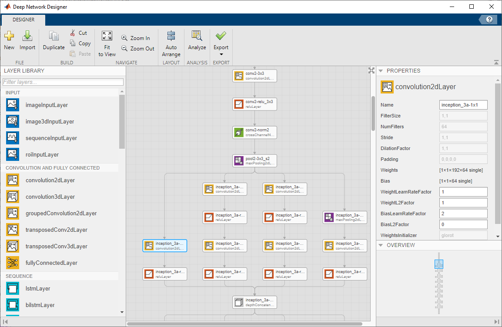

# Overview

GoogLeNet is a convolutional neural network that is trained on more than a million images from the ImageNet database. As a result, the network has learned rich feature representations for a wide range of images. The network can classify images into 1000 object categories, such as keyboard, mouse, pencil, and many animals.

The network has an image input size of 224-by-224-by-3. 

# Usage

This repository requires [MATLAB](https://www.mathworks.com/products/matlab.html) (R2018b and above) and the [Deep Learning Toolbox](https://www.mathworks.com/products/deep-learning.html).

This repository provides three functions:
- googlenetLayers: Creates an untrained network with the network architecture of GoogLeNet
- assembleGoogLeNet: Creates a GoogLeNet network with weights trained on ImageNet data
- googlenetExample: Demonstrates how to classify an image using a trained GoogLeNet network

To construct an untrained GoogLeNet network to train from scratch, type the following at the MATLAB command line:
```matlab
lgraph = googlenetLayers;
```
The untrained network is returned as a `layerGraph` object.

To construct a trained GoogLeNet network suitable for use in image classification, type the following at the MATLAB command line: 
```matlab
net = assembleGoogLeNet;
```
The trained network is returned as a `DAGNetwork` object.

To classify an image with the network:
```matlab
img = imresize(imread("peppers.png"),[224 224]);
predLabel = classify(net, img);
imshow(img);
title(string(predLabel));
```

# Documentation

For more information about the GoogLeNet pre-trained model, see the [googlenet](https://www.mathworks.com/help/deeplearning/ref/googlenet.html) function page in the [MATLAB Deep Learning Toolbox documentation](https://www.mathworks.com/help/deeplearning/index.html).

# Architecture

GoogLeNet is a residual network. A residual network is a type of DAG network that has residual (or shortcut) connections that bypass the main network layers. Residual connections enable the parameter gradients to propagate more easily from the output layer to the earlier layers of the network, which makes it possible to train deeper networks. This increased network depth can result in higher accuracies on more difficult tasks.

You can explore and edit the network architecture using [Deep Network Designer](https://www.mathworks.com/help/deeplearning/ug/build-networks-with-deep-network-designer.html).



# GoogLeNet in MATLAB

This repository demonstrates the construction of a residual deep neural network from scratch in MATLAB. You can use the code in this repository as a foundation for building residual networks with different numbers of residual blocks.

You can also create a trained GoogLeNet network from inside MATLAB by installing the Deep Learning Toolbox Model for GoogLeNet Network support package. Type `googlenet` at the command line. If the Deep Learning Toolbox Model for GoogLeNet Network support package is not installed, then the function provides a link to the required support package in the Add-On Explorer. To install the support package, click the link, and then click Install.

Alternatively, you can download the GoogLeNet pre-trained model from the MathWorks File Exchange, at [Deep Learning Toolbox Model for GoogLeNet Network](https://www.mathworks.com/matlabcentral/fileexchange/64456-deep-learning-toolbox-model-for-googlenet-network). 

You can create an untrained GoogLeNet network from inside MATLAB by importing a trained GoogLeNet network into the Deep Network Designer App and selecting Export > Generate Code. The exported code will generate an untrained network with the network architecture of GoogLeNet.
